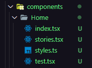
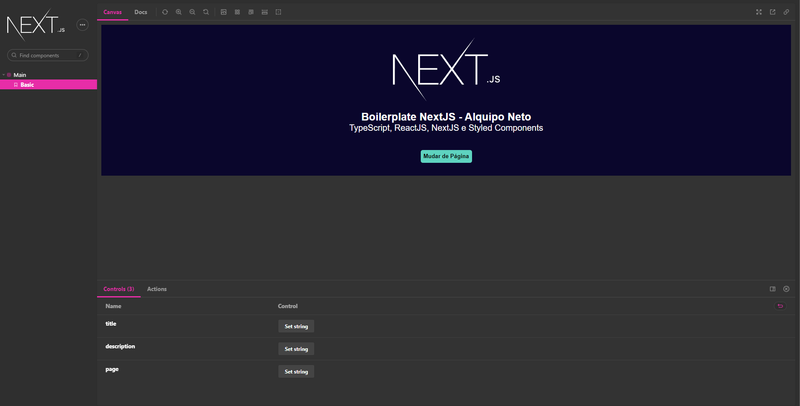
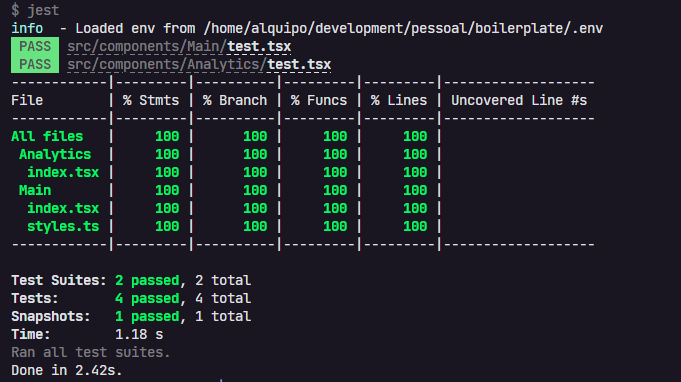

<h1 align="center">
    Span IRA Calculator
</h1>

<p align="center">

  <a target="_blank" href="https://reactjs.org/">
    
  </a>

  <a target="_blank" href="https://nextjs.org/">
      
  </a>
</p>

## 🚀 About the project

Project using [Next.js](https://nextjs.org/).

## 🎨 Layout

<!-- Design made by -->

<table>
  <tr>
    <td colspan="1"><h4 align="center">Component Generation</h4> </td>
    <td colspan="1"><h4 align="center">Storybook</h4></td>
    <td colspan="1"><h4 align="center">Unit Tests</h4></td>
  </tr>
  <tr>
    <td></td>
    <td></td>
    <td></td>

  </tr>
</table>

## 🔨 Tecnologies:

- **[TypeScript](https://www.typescriptlang.org/)**
- **[NextJS](https://nextjs.org/)**
- **[Styled Components](https://styled-components.com/)**
- **[Jest](https://jestjs.io/)**
- **[React Testing Library](https://testing-library.com/docs/react-testing-library/intro)**
- **[Storybook](https://storybook.js.org/)**
- **[Eslint](https://eslint.org/)**
- **[@alquipo/eslint-config](https://www.npmjs.com/package/@alquipo/eslint-config)**
- **[Prettier](https://prettier.io/)**
- **[Husky](https://github.com/typicode/husky)**
- **[git-commit-msg-linter](https://www.npmjs.com/package/git-commit-msg-linter)**
- **[PlopJS](https://plopjs.com/)**

## 🔎 Commands

- `dev`: Executes the application at `localhost:3001`
- `build`: Generates projects build
- `start`: Starts production folder .next
- `lint`: Execute **Lint** in all components
- `test`: Execute **Jest** in all components
- `test:watch`: Execute **Jest** in watch mode
- `storybook`: Execute **Storybook** in `localhost:6006`
- `build-storybook`: Generate a local build of storybook
- `generate`: Generate a new Component

## 🚀 How to run this project

To run this application you have to install [Git](https://git-scm.com) and [NodeJs](https://nodejs.org/en/) in your computer.

### 🎲 Run the application

```bash
$ yarn install

$ yarn dev
```

### 💾 Usefull Commands

```bash
#Generate a complete component (index.tsx / stories.tsx / styles.ts / test.tsx)
$ yarn generate ComponentName
```

</h3>
